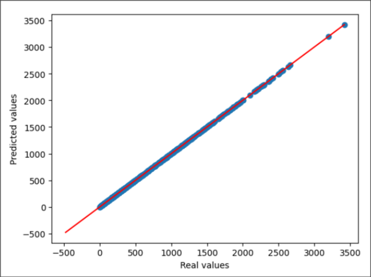

# 2. MTDE::1.2. Regression::Lab Evaluation 23/24 (ES) sample

<style>
hr { border-style: dashed; }
</style>

## <!-- MARK: LabEv1 23-24 ES Q1 -->
Se dispone de un conjunto de datos que ha sido dividido en 3 matrices `X_train`, `X_val`, `X_test` (para entrenamiento, validación y test, respectivamente), que deben normalizarse para obtener las matrices de datos siguientes:

```text
X_train_s : Conjunto de entrenamiento
X_val_s : Conjunto de validación
X_test_s : Conjunto de test
```

¿Cual es la forma correcta de normalizar?

* [ ] a)

    ```python
    from sklearn.preprocessing import StandardScaler
    scaler = StandardScaler()
    X_train_s = scaler.transform(X_train_val)
    X_val_s = scaler.transform(X_val)
    X_test_s = scaler.transform(X_test)
    ```

* [ ] b)

    ```python
    from sklearn.preprocessing import StandardScaler
    scaler = StandardScaler()
    X_train_s = scaler.fit_transform(X_train_val)
    X_val_s = scaler.fit_transform(X_val)
    X_test_s = scaler.fit_transform(X_test)
    ```

* [ ] c)

    ```python
    from sklearn.preprocessing import StandardScaler
    scaler = StandardScaler()
    X_train_s = scaler.fit_transform(X_train_val)
    X_val_s = scaler.transform(X_val)
    X_test_s = scaler.transform(X_test)
    ```

* [ ] d)

    ```python
    from sklearn.preprocessing import StandardScaler
    scaler = StandardScaler()
    X_train_s = scaler.fit(X_train_val)
    X_val_s = scaler.transform(X_val)
    X_test_s = scaler.transform(X_test)
    ```

***

* [x] c)

    ```python
    from sklearn.preprocessing import StandardScaler
    scaler = StandardScaler()
    X_train_s = scaler.fit_transform(X_train_val)
    X_val_s = scaler.transform(X_val)
    X_test_s = scaler.transform(X_test)
    ```

## <!-- MARK: LabEv1 23-24 ES Q2 -->
Tras completar la normalización de la pregunta anterior, se calculan los valores siguientes:

```python
m_train = np.mean(X_train_s, axis=0)
m_val = np.mean(X_val_s, axis=0)
std_train = np.std(X_train_s, axis=0)
std_test = np.mean(X_test_s, axis=0)
```

Indique la opción correcta

* [ ] a) `m_train[0] = 0`
* [ ] b) `m_val[0] = 0`
* [ ] c) `std_train[0] = 0`
* [ ] d) `std_test[0] = 1`

***

* [x] a) `m_train[0] = 0`

## <!-- MARK: LabEv1 23-24 ES Q3 -->
Se dispone de un conjunto de datos que ha sido dividido en 3 subconjuntos (entrenamiento, validación y test), guardados en tres arrays bidimensionales de numpy (`X_train`, `X_val` y `X_test`, respectivamente), donde cada fila representa una muestra.

Se desea ajustar un modelo de Ridge regression, eligiendo el valor del parámetro alpha por validación, entre los valores en

```python
alpha_list = [0.1, 0.2, 0.4, 0.8, 1.6]
```

Recorriendo esta lista de valores, para cada valor de `alpha` se ha ajustado el modelo y se ha calculado el coeficiente $R^2$ con los datos de entrenamiento y con los de validación, obteniendo, respectivamente, las listas de valores

```python
R2_train = [-1, 0.9, 0.3, 0.8, 0]
R2_val = [-0.9, 0.1, 0.8, 0.6, 0.5]
```

De acuerdo con los valores obtenidos, debe elegirse el valor

* [ ] a) `alpha = 0.1`
* [ ] b) `alpha = 0.2`
* [ ] c) `alpha = 0.4`
* [ ] d) `alpha = 0.8`

***

* [x] c) `alpha = 0.4`

## <!-- MARK: LabEv1 23-24 ES Q4 -->
A la hora de representar las etiquetas de los datos de test frente a las predicciones hechas por el modelo, los puntos aparecen perfectamente alineados en la diagonal como indica la figura. ¿Qué podemos afirmar sobre las prestaciones del modelo?



* [ ] a) Tiene un R2 igual a 0
* [ ] b) Tiene un R2 igual a 1
* [ ] c) Tiene un RMSE igual a 1
* [ ] d) Su R2 es inferior a su RMSE

***

* [x] b) Tiene un R2 igual a 1

## <!-- MARK: LabEv1 23-24 ES Q5 -->
Se dispone de un conjunto de datos que ha sido dividido en 3 subconjuntos (entrenamiento, validación y test), guardados en tres arrays bidimensionales de numpy (`X_train`, `X_val` y `X_test`, respectivamente) con sus respectivos arrays de las variables objetivo (`y_train`, `y_val` e `y_test`). Los datos ya están normalizados.

Con estos datos, se ha aplicando un procedimiento estándar de validación para determinar los parámetros `alpha` y `gamma` de un modelo Kernel Ridge con kernel rbf, y se han obtenido los valores `alpha=0.3` y `gamma=1`.

Se desea obtener el modelo final con estos parámetros, y estimar sus prestaciones mediante el RMSE. Para ello, se construye el objeto

```python
kernel_ridge = KernelRidge(kernel=’rbf’, alpha=0.3, gamma=1)
```

Indique cuál es la secuencia de instrucciones apropiada.

* [ ] a)

    ```python
    kernel_ridge.fit(X_train, y_train)
    y_pred = kernel_ridge.predict(X_val)
    rmse_kernel = mean_squared_error(y_val, y_pred, squared=False)
    ```

* [ ] b)

    ```python
    kernel_ridge.fit(X_train, y_train)
    y_pred = kernel_ridge.predict(X_test)
    rmse_kernel = mean_squared_error(y_test, y_pred, squared=False)
    ```

* [ ] c)

    ```python
    kernel_ridge.fit(X_val, y_val)
    y_pred = kernel_ridge.predict(X_val)
    rmse_kernel = mean_squared_error(y_test, y_pred, squared=False)
    ```

* [ ] d)

    ```python
    kernel_ridge.fit(X_test, y_test)
    y_pred = kernel_ridge.predict(X_test)
    rmse_kernel = mean_squared_error(y_test, y_pred, squared=False)
    ```

***

* [x] b)

    ```python
    kernel_ridge.fit(X_train, y_train)
    y_pred = kernel_ridge.predict(X_test)
    rmse_kernel = mean_squared_error(y_test, y_pred, squared=False)
    ```

## <!-- MARK: LabEv1 23-24 ES Q6 -->
Indique cual de las siguientes afirmaciones es verdadera.

* [ ] a) Para un mismo dataset, el parámetro `alpha` es común a los modelos Lasso, Ridge, y KernelRidge: una vez obtenido el mejor valor para un modelo, podemos asegurar que es también el mejor valor para los otros dos.
* [ ] b) Todos los modelos utilizados en la práctica (LinearRegression, Lasso, Ridge y KernelRidge) requieren optimizar un hiperparámetro: `alpha`, `gamma` o ambos.
* [ ] c) El número de parámetros de un modelo de regresión semilineal no depende del grado del polinomio
* [ ] d) El modelo Kernel Ridge es no lineal respecto a las observaciones.

***

* [x] d) El modelo Kernel Ridge es no lineal respecto a las observaciones.

## <!-- MARK: LabEv1 23-24 ES Q7 -->
Se va a utilizar un algoritmo de aprendizaje automático que tiene 3 parámetros para validar llamados alpha, beta y gamma. Para cada uno de estos parámetros se quieren validar los siguientes valores:

```python
alpha = [1e-5, 1e-4, 0.001, 0.01, 0.1, 1, 10, 100, 200]
beta = [1, 2, 3, 4, 5]
gamma = [1, 10, 100, 1000]
```

¿Cuantos modelos se crearán para encontrar el mejor valor?

* [ ] a) 18
* [ ] b) 9
* [ ] c) 900
* [ ] d) 180

***

* [x] d) 180

## <!-- MARK: LabEv1 23-24 ES Q8 -->
La técnica de analizar los pesos de un modelo para identificar qué variables son las más importantes, ¿en qué algoritmo *no* podría utilizarse?

* [ ] a) Regresor lineal
* [ ] b) Regresor Ridge
* [ ] c) Regresor Lasso
* [ ] d) Regresor KernelRidge

***

* [x] d) Regresor KernelRidge

## <!-- MARK: LabEv1 23-24 ES Q9 -->
¿Cual de las siguientes afirmaciones sobre los resultados de la practica es FALSA?

* [ ] a) Al crear un modelo utilizando únicamente la mejor variable, se obtienen mejores prestaciones que al utilizar todas las variables.
* [ ] b) El modelo Kernel Ridge ha obtenido las mejores prestaciones.
* [ ] c) Los modelos polinómicos lineal y LASSO han obtenido mejores prestaciones que sus equivalentes no polinómicos.
* [ ] d) Ridge Regression y LASSO han obtenido prestaciones muy similares.

***

* [x] a) Al crear un modelo utilizando únicamente la mejor variable, se obtienen mejores prestaciones que al utilizar todas las variables.
* [x] c) Los modelos polinómicos lineal y LASSO han obtenido mejores prestaciones que sus equivalentes no polinómicos.

## <!-- MARK: LabEv1 23-24 ES Q10 -->
Indique qué modelo de regresión tiende a dar valor cero a los coeficientes asociados a las características de entrada menos relevantes:

* [ ] a) `LinearRegression`
* [ ] b) `Ridge`
* [ ] c) `Lasso`
* [ ] d) `KernelRidge`

***

* [x] c) `Lasso`
